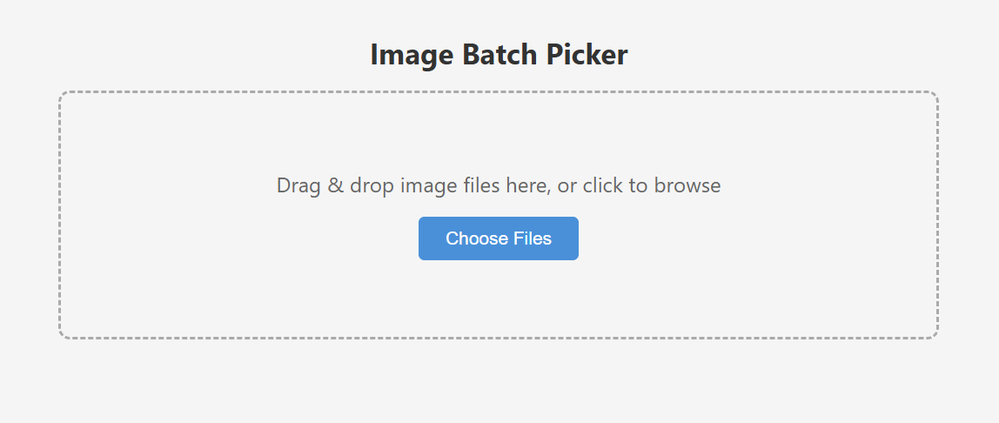

# Image Batch Picker

A single-file browser tool for selecting one image per batch and downloading the picks as a ZIP.



## Usage

1. Open `index.html` in any modern browser.
2. Drag and drop image files onto the upload zone (or click to browse).
3. Files are grouped by their leading number prefix — e.g., `1_a.jpg` and `1_b.jpg` form batch 1.
4. Click an image to select it. The next batch appears automatically.
5. Use the **Back** button to revisit a previous batch and change your selection.
6. After the final batch, review your selections and click **Download ZIP**.

## File naming

Images must start with a number prefix:

```
1_sunset.jpg
1_sunrise.jpg
2_mountain.png
2_valley.png
3_ocean.webp
```

Files without a numeric prefix are ignored.

## Requirements

- A modern browser (Chrome, Firefox, Edge, Safari)
- Internet connection on first load (JSZip is loaded from CDN)
